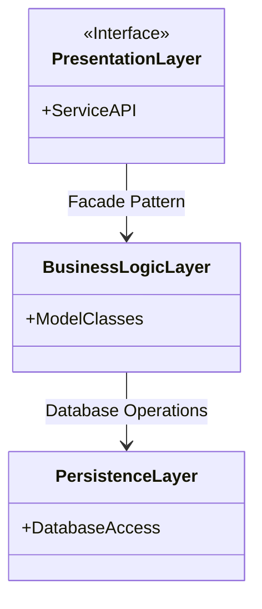
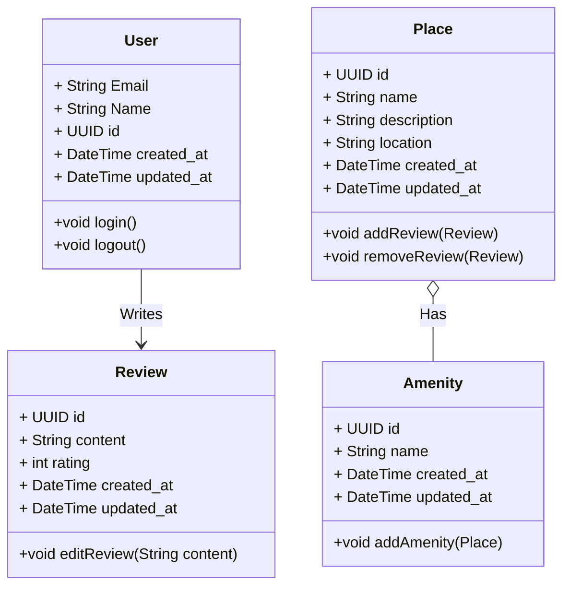
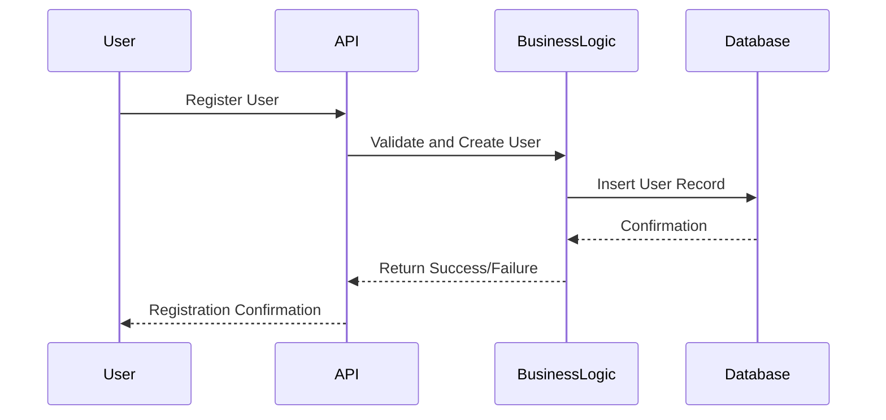
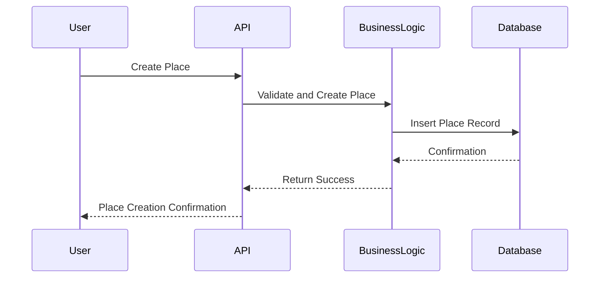
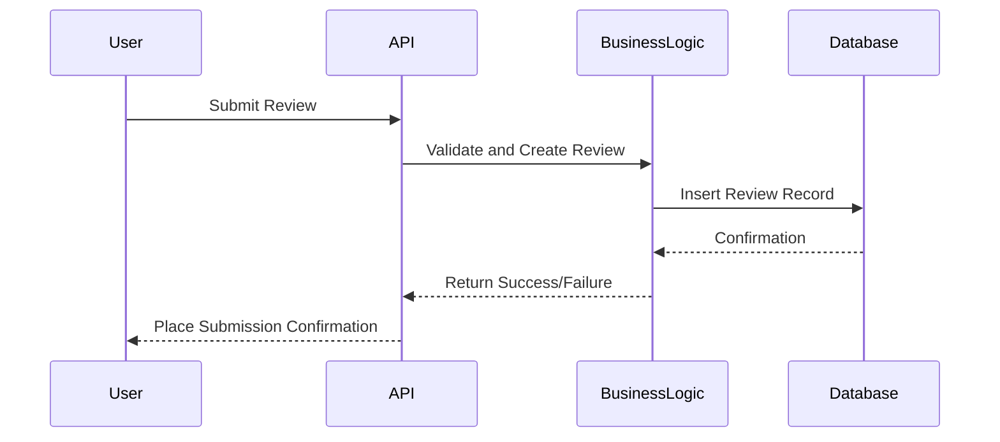
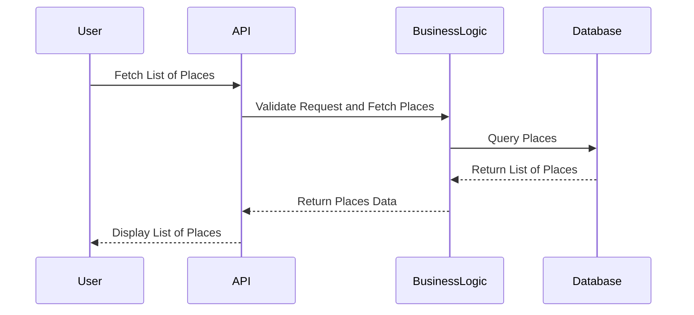

# HBnB Project

## Introduction
This technical document serves as a comprehensive guide to the architecture and design of the HBnB project. It consolidates key diagrams, including high-level architecture, class design, and API interaction flows, and provides explanatory notes that clarify system components and interactions. The purpose of this document is to serve as a detailed blueprint for developers and stakeholders during the implementation phases, ensuring a consistent and well-structured approach to building the HBnB application.

# 1 - High-Level Package
## High-Level Package Diagram

The above diagram represents the three-layer architecture of the HBnB application, consisting of the Presentation Layer (Service APIs), Business Logic Layer (Models), and Persistence Layer (Database). The communication between the layers follows the Facade Pattern, simplifying interactions by providing a unified interface.

### Explanation:
- Presentation Layer: Manages user interaction, exposing services and APIs. Communicates with the Business Logic Layer via a Facade.
- Business Logic Layer: Contains the core business models such as User, Place, Review, and Amenity. It processes requests and interacts with the Persistence Layer.
- Persistence Layer: Handles data storage and retrieval, interfacing with the database.

# 2 - Business Logic Layer
## Detailed Class Diagram

The detailed class diagram showcases the entities in the Business Logic Layer and their relationships. It includes the User, Place, Review, and Amenity classes, along with their attributes, methods, and interactions.

### Explanation:
- User: Represents a user in the system, including attributes like id, name, and email. It interacts with reviews and manages login/logout functionality.
- Place: Represents a property or place, including details like name, description, and location. A place can have reviews and amenities.
- Review: Allows users to provide feedback about a place, containing information such as content and rating.
- Amenity: Represents an amenity associated with a place, allowing properties to provide additional features.

#  3 - API Interaction Flow
This section details the sequence of interactions across the layers for four essential API calls: user registration, place creation, review submission, and fetching a list of places.
## API Call 1: User Registration

### Explanation:
- User Registration Flow: The process begins when a user sends a registration request via the API. The request is validated and processed by the Business Logic Layer, which interacts with the Persistence Layer to store user details in the database. Finally, the API returns a registration confirmation to the user.
## API Call 2: Place Creation

### Explanation:
- Place Creation Flow: A user initiates a place creation request, which is validated by the Business Logic Layer. The details are saved in the database, and a confirmation is returned to the user, completing the process.

## API Call 3: Review Submission

### Explanation:
- Review Submission Flow: When a user submits a review, the system processes it through the Business Logic Layer, saving the review details in the database. A confirmation is returned to indicate whether the submission was successful.

## API Call 4: Fetching a List of Places

### Explanation:
- Fetching Places Flow: The user requests a list of places, which is processed by the Business Logic Layer after validating the request. The Persistence Layer fetches the matching places from the database, and the results are returned to the user.

## Conclusion

This document provides a thorough overview of the HBnB application's architecture and key interactions. By detailing the three-layer architecture, outlining the business logic through class diagrams, and visualizing API calls via sequence diagrams, this blueprint serves as a guide for development and implementation. The clear separation between layers, the use of the facade pattern, and the structured interaction flows ensure a scalable, maintainable system design.

This technical blueprint will serve as a reference throughout the development lifecycle, ensuring alignment with the system's design principles and architectural decisions.
