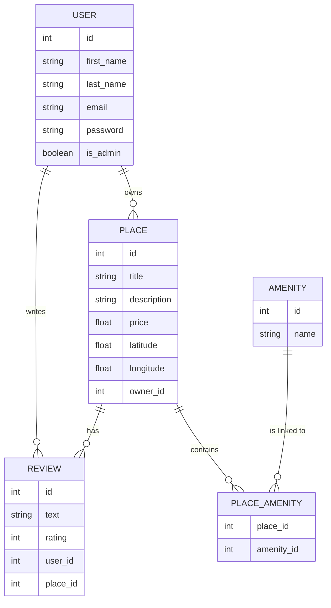

## Description of HBnb Part3 

Welcome to Part 3 of the HBnB Project, where you will extend the backend of the application by introducing user authentication, authorization, and database integration using SQLAlchemy and SQLite for development.

## Objectives of the Project 

- Authentication and Authorization: Implement JWT-based user authentication using Flask-JWT-Extended and role-based access control with the is_admin attribute for specific endpoints.

- Database Integration: Replace in-memory storage with SQLite for development using SQLAlchemy as the ORM and prepare for MySQL or other production grade RDBMS.

- CRUD Operations with Database Persistence: Refactor all CRUD operations to interact with a persistent database.

- Database Design and Visualization: Design the database schema using mermaid.js and ensure all relationships between entities are correctly mapped.

- Data Consistency and Validation: Ensure that data validation and constraints are properly enforced in the models.

## Structure of the Project

#### In this part of the project, the tasks are organized in a way that builds progressively towards a complete, secure, and database-backed backend system:

- Modify the User Model to Include Password: You will start by modifying the User model to store passwords securely using bcrypt2 and update the user registration logic.

- Implement JWT Authentication: Secure the API using JWT tokens, ensuring only authenticated users can access protected endpoints.

- Implement Authorization for Specific Endpoints: You will implement role-based access control to restrict certain actions (e.g., admin-only actions).

- SQLite Database Integration: Transition from in-memory data storage to SQLite as the persistent database during development.

- Map Entities Using SQLAlchemy: Map existing entities (User, Place, Review, Amenity) to the database using SQLAlchemy and ensure relationships are well-defined.

- Prepare for MySQL in Production: Towards the end of this phase, you’ll configure the application to use MySQL in production and SQLite for development.

- Database Design and Visualization: Use mermaid.js to create entity-relationship diagrams for your database schema.

## Database ER Diagram

## Authors

- [Dylan](https://github.com/Bruqui)
- [Steven](https://github.com/S1even)